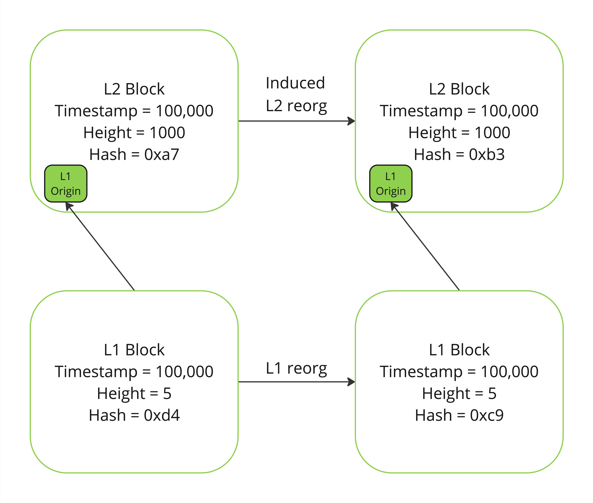
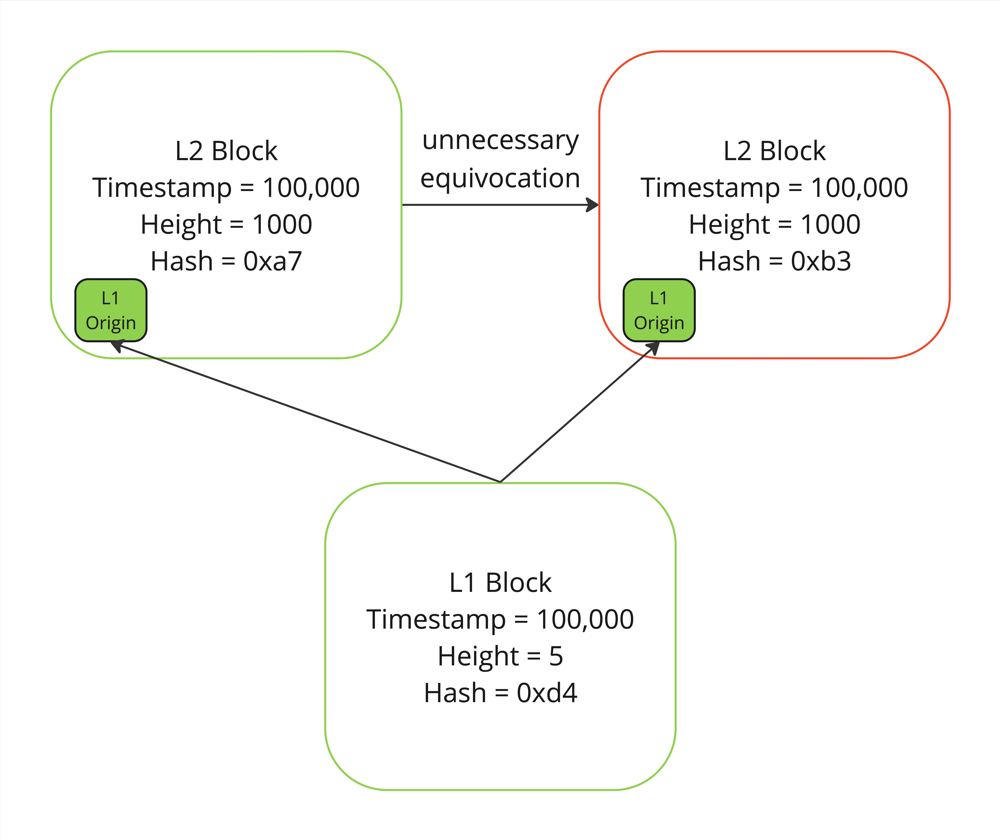

## Abstract

This proposal describes a simple general means to prove within the L1 execution environment that a sequencer has
needlessly equivocated L2 blocks.

This approach will work for any rollup that meets the following requirements:
1. The rollup settles its state roots to the L1 in a trustless manner (e.g. using fault proof system or validity proofs).
2. The rollup maintains within its execution environment a trusted view of the L1 state that the current rollup block
considered for L1 inputs (implements RIP-7859). This L1 state is referred to hereon out as the L1Origin of an L2 block.
3. The correctness of the rollup->L1 origin mapping is enforced by the constraints of the fault proof system or validity
proofs used to settle rollup state roots to the L1.
4. The sequencer signs preconfirmations to all rollup blocks whose ordering has not yet been finalized through L1 data
availability commitments.
5. These signed preconfirmations include a state root for the unfinalized L2 block.
6. The public key for the sequencer, or an address that can be recovered from its signatures, is known inside the L1
execution environment.

Many L2s, such as all op-stack L2s and Scroll L2s, already meet these requirements. 

## Motivation

In the absence of a fast confirmation later L2s can provide three levels of finality:
* FINAL: The transaction data for this rollup block has been submitted to the data availability layer and the
transaction containing the commitment to this DA batch has been finalized on the L1.
* SAFE: The transaction data for this rollup block has been submitted to a data availability layer and a transaction
* containing the commitment to this DA batch has been submitted on the L1 but has not been finalized.
* UNSAFE: The transaction data for this rollup block has not been submitted to the data availability layer or it has
* been submitted but the transaction committing the DA batch into the L1 has not been submitted to the L1.

Once SAFE finality has been achieved the only mechanism by which the sequencer can reorg the committed segment of blocks
is if an L1 reorgs such that the DA commitment transaction is removed.

Once FINAL finality has been achieved there is no mechanism by which the sequencer can reorg the committed segment of
blocks.

UNSAFE finality is often referred to as a “preconfirmation”, at this level the only guarantee that blocks will not be
reordered/replaced before the ordering is committed into the L1 is a promise made by the sequencer. The sequencer
is the only entity that can attest to the eventual finality of an UNSAFE L2 block.

For L2s with single sequencers, users must trust the sequencer to honor these preconfirmations. Regardless of the
validity of the state in a preconfirmed block there is _nothing_ mechanically binding the sequencer to finalize the same
state that it preconfirmed on the L1.

L2 sequencers can attest to the ordering of transactions in this UNSAFE region by gossiping signed payloads
corresponding to preconfirmed states. It is possible that a sequencer may be _required_ to reorg these preconfirmed
blocks in the event that the L1 state these blocks included inputs from becomes non-canonical due to a L1 reorg. Any
mechanism for proving sequencer equivocation must be able to account for this scenario so that only _unncessary_
equivocation is a punishable offense.

Currently, there is no general mechanism described by which a user can prove a sequencer reneged on their
preconfirmation guarantees when doing so was not necessitated by a reorg of a L1. Herein we describe such a mechanism
that leverages the L1 origin view committed into a rollup to allow users to prove within a contract deployed inside the
L1 execution environment that a sequencer reorged a preconfirmed rollup block- equivocating at a given rollup block
height- when an L1 reorg did not require such an action.

This functionality extends to SAFE reorgs as well. If an L1 reorg removes a DA commitment the sequencer does not *need*
to and so should not reorder the contents of the DA batch _unless_ the reorg additionally impacted the L1 origins of
rollup blocks in that batch. If the batch origins were not impacted by the L1 reorg that removed the batch commitment,
then the same batch commitment can- and should- simply be resubmitted to the L1.

This capability is useful in providing a means of recompense in the event of a sequencer unnecessarily reordering UNSAFE
rollup blocks in a manner that negatively impacts users. When used in combination with mechanisms that slash sequencers
and/or payout users in this event, this provides a means of reducing reliance on “good” sequencer behavior. This
document only describes the mechanism for proving unnecessary equivocation within the L1 execution environment, precisely
how this proof is processed to affect a downstream outcome and the nature of the outcome (e.g. sequencer slashing,
insurance payout, etc) is not specified here.

## Specification

We define a signed preconfirmation as

`SignedPreconfirmation = ECDSA(L2BlockHash, L2StateRoot, L2BlockHeight)`

Notice that a preconfirmation may include other fields or include only a signed L2_BLOCK_HASH. Additional fields are unneccessary
and are ignored for the purposes of this RIP and a L2_BLOCK_HASH commits to the L2_STATE_ROOT and L2_BLOCK_HEIGHT but
signing over these fields directly and excluding other fields makes the proving process more gas efficient on the L1.

Proving equivocation between a signed ExecutionPayloadEnvelope and a settled L2Output is straightforward assuming a
fault proof system (or validity proofs) are in place.
1. User submits the valid L2Output at the equivocated block height to the proof system
2. Once it is verified by the proof system…
3. User submits a signed ExecutionPayloadEnvelope that has the same block height but a different blockhash
4. Contract checks that
   1. SignedPreconfirmation.L2BlockHash ≠ L2Output.BlockHash
   2. SignedPreconfirmation.L2BlockHeight == L2Output.BlockHeight

For L2s that support RIP-7859 it is valid and necessary to equivocate in the case where an L1 reorg changes the nascent
L2 block's L1Origin, as shown above.
   
In order to only punish equivocation which was unnecessary we need to not punish equivocation if it is because the
L1Origin reorged and necessitated a reorg of the nascent L2 block.

If a nascent L2 block is reorged despite the L1Origin not changing between the equivocating blocks, as shown above,
this is a readily attributable fault.

To accomplish this we need to add a step to our contract so that we check that the L1Origin is the same.
The process becomes:
1. User submits the valid L2Output at the equivocated block height to the proof system
2. Once it is verified by the proof system…
3. User submits a signed ExecutionPayloadEnvelope that has the same block height but a different blockhash
4. Contract checks that
   1. SignedPreconfirmation.L2BlockHash ≠ L2Output.BlockHash
   2. SignedPreconfirmation.L2BlockHeight == L2Output.BlockHeight
   3. SignedPreconfirmation.L2StateRoot.L1Origin == L2Output.L1Origin
      1. Proving the state of the L1Origin will require providing a Merkle proof opening the L2StateRoot up to the standardized
      location in the L2 state that stores the L1Origin info

IFF the above are all true then the sequencer reorged a L2 block when it did not need to. We can then have arbitrary
downstream mechanisms to slash/punish them or reward/recoup losses to the affected parties.
Slashing/punishing is easier as the above establishes- inside the L1 execution environment- an objective attribution of
fault linked to the sequencer, but it is more difficult to recompense affected parties as we have not established an objective link to them yet.

The above process describes a simple mechanism to prove unnecessary equivocation in the simplest case, but there a
number of clever ways that a sequencer could bypass this approach by making it _appear_ as though the L1Origin changed
when it didn't need to.

This can be done in three ways:
1. The sequencer first signs a preconfirmation that includes an invalid L1Origin that represents a valid L1 state
at height N but one that never existed or received sufficient L1 validator attestations to be considered a valid
candidate block at height N. (NOTE: look into the precise number of attestations required from L1 validators for an L1
block to be considered valid pending finalization). When finalizing an L2 block at this preconfirmed height on the L1
the sequencer (necessarily) changes the L1Origin to the canonical L1 block at height N. To the naive process described
above this equivocation looks necessary since the L1Origin changed.
2. The sequencer does the same as above, but instead uses an entirely invalid L1Origin (represents an invalid state,
not just a non-canonical one for the given height). The reason this is considered separately from the above is because
proving equivocation is not strictly necessary in this case, one can instead prove the L2 block is simply invalid.
3. The sequencer first signs a preconfirmation for L2 block M that includes a valid L1Origin at height N but then
equivocates with a different L2 block M that includes a valid L1Oriign at height N+x.

### Pseudocode

## Security Considerations

Implementers must make sure that the proof verification contract on the L1 is bug free.

## Copyright

Copyright and related rights waived via [CC0](../LICENSE.md).
